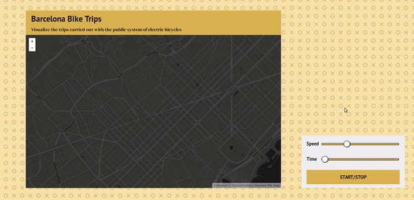

# Barcelona Bike Trips Visualization

Visualization of the trips carried out with the public system of electric bicycles of the city of Barcelona. 

This repo is based on the data generated on the [imartinezl/bicing-analysis](https://github.com/imartinezl/bicing-analysis) repo, which estimates bicycle trips based on the state of each station over time.

the contains the first version of the visualization, which was improved later on. Check out the
